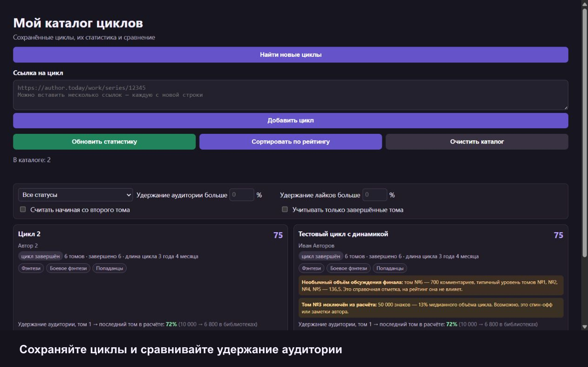
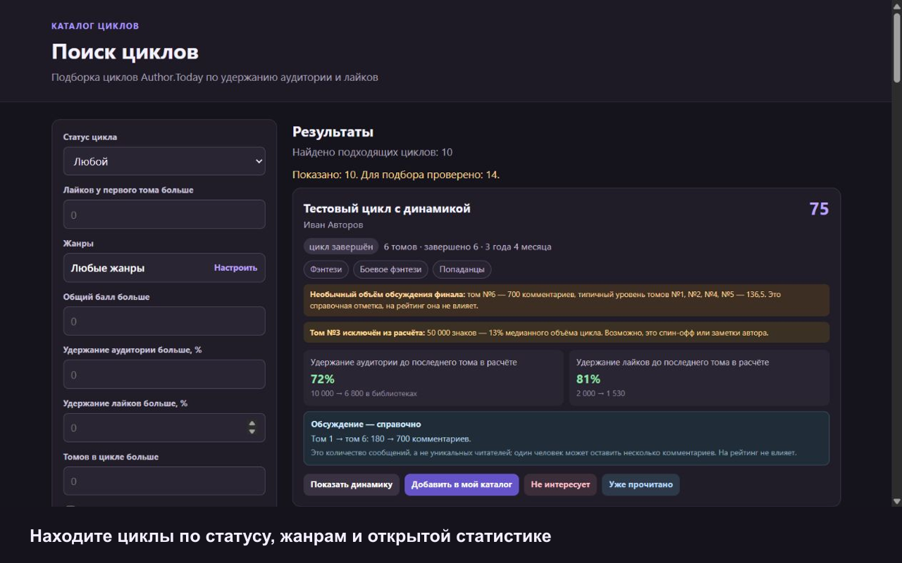

# Каталог циклов для Author.Today

При первом запуске расширение запрашивает явное согласие на локальную обработку адреса и открытого содержимого страниц Author.Today. До согласия сбор и обновление статистики не запускаются.

Расширение для Chrome, Edge и Яндекс.Браузера: собирает публичные данные выбранных циклов Author.Today в локальное хранилище браузера и ранжирует их по удержанию аудитории и лайков. Удержание аудитории считается по сумме статусов «Читаю / слушаю», «Отложено на потом» и «Прочитано»; «Не интересно» в эту сумму не входит.





## Установка

1. Откройте страницу расширений браузера: `chrome://extensions`, `edge://extensions` или `browser://extensions` в Яндекс.Браузере.
2. Включите «Режим разработчика».
3. Нажмите «Загрузить распакованное» и выберите эту папку.
4. Откройте карточку расширения и закрепите его на панели браузера.

После публикации стабильную версию можно будет установить из [Chrome Web Store](https://chromewebstore.google.com/detail/omdnnakgjlbjfblpciogifkbhbfknkcj).

## Проверка кода

Для офлайн-проверки требуется Node.js 20 или новее. Зависимостей для запуска расширения и тестов нет.

```bash
npm test
```

Сетевой интеграционный тест обращается к открытым страницам и гостевому API Author.Today. Запускайте его отдельно и не повторяйте без необходимости:

```bash
npm run test:integration
```

## Работа

- Нажатие на значок расширения показывает статистику цикла для открытой страницы цикла или любого входящего в него тома Author.Today. Здесь можно переключить расчёт со второго тома или только по завершённым томам, обновить данные и добавить этот цикл в каталог. Для самостоятельного тома расширение сообщает, что он не входит в цикл.
- Кнопка «Открыть мой каталог» открывает отдельную полноразмерную страницу со всеми сохранёнными циклами, фильтрами, сравнением и графиками. Показ статистики не удаляет сохранённые циклы.
- Кнопка «Найти новые циклы» открывает отдельную страницу подбора. Официальный каталог Author.Today выдаёт первые тома циклов, после чего расширение рассчитывает рейтинг подходящих серий.
- Поиск подбирает до 10 подходящих циклов за один шаг, просматривая столько страниц каталога, сколько потребуется. На каждой карточке показываются первые три жанра первого тома. Кандидатов можно ограничить минимальным числом лайков у первого тома и минимальным количеством томов в цикле. Кнопка «Показать ещё 10 циклов» продолжает с места остановки; результаты кэшируются локально на сутки.
- В найденной подборке цикл можно добавить в личный каталог или исключить кнопками «Не интересует» и «Уже прочитано». Исключения сохраняются только в браузере и восстанавливаются в разделе «Исключённые циклы».
- На странице цикла появится кнопка «Добавить цикл». Нажатие сохраняет ссылку в локальный каталог.
- Либо вставьте несколько ссылок вида `https://author.today/work/series/12345` на странице «Мой каталог».
- Сохранённые карточки показываются на странице каталога сразу. Нажмите «Обновить статистику», чтобы пересчитать устаревшие данные; циклы останутся сохранены, удалить их можно только вручную.
- Изменение фильтров и обновление статистики не переставляет карточки. Кнопка «Сортировать по рейтингу» явно выстраивает циклы по баллу выбранного варианта расчёта и фиксирует этот порядок до следующей ручной сортировки или перезагрузки страницы.
- Фильтры позволяют отдельно задать минимальное удержание аудитории и лайков, начать расчёт со второго тома и учитывать только завершённые тома.
- Адаптивный фильтр жанров использует иерархию Author.Today, которая обновляется не реже одного раза в сутки. В каждой строке есть чекбоксы «Учитывать» и «Исключить»: выбор одного сразу снимает второй, а повторное нажатие снимает текущее правило. Выбор общей категории применяется ко всем её поджанрам, после чего отдельные пункты можно изменить вручную. Минус у категории означает, что внутри неё выбраны не все поджанры; тома без поджанра учитываются по правилу общей категории. Фильтр проверяет жанры первого тома: совпадение хотя бы с одним правилом «Исключить» удаляет из выдачи весь цикл. Фильтр применяется до расчёта рейтинга.
- Карточка показывает длину цикла от первой публикации первого тома до последнего обновления последнего тома — в годах и месяцах. Для интервала короче 30 дней выводится «менее месяца».
- Рейтинг рассчитывается только при наличии минимум трёх участвующих томов. Если после выбранных фильтров и исключений осталось меньше, карточка показывает причину вместо ненадёжного балла.
- Итоговый балл имеет шкалу 0–100: до 60 баллов за удержание добавлений в библиотеку и до 40 баллов за удержание лайков. 50 баллов означает ожидаемое удержание для такого числа участвующих томов и срока между публикациями базового и последнего тома. Более длинный или долгий цикл сравнивается с более сложным эталоном, поэтому конвейерная публикация не получает автоматического преимущества. Модель построена на контрольной выборке из 300 завершённых циклов; для устойчивости использовались финальные тома возрастом не меньше шести месяцев. Исходная популярность на балл не влияет.
- Карточка показывает исходные проценты, простой вывод «выше/ниже обычного» среди похожих циклов и понятный срок сохранения половины аудитории. Если граница 50% уже пройдена, срок определяется между соседними томами; иначе выводится приблизительная оценка по текущей динамике. При росте аудитории прогноз не строится.
- Точные ожидаемые проценты и вклад 60/40 доступны в подсказке рейтинга; медианный интервал публикаций и отношение «лайков на 100 добавлений» — в диагностическом отчёте. Отношение лайков к добавлениям не входит в рейтинг: иначе два уже учтённых счётчика повлияли бы на балл повторно.
- Комментарии не входят в рейтинг и не используются как процент удержания: один читатель может оставить сколько угодно сообщений. На карточке они показаны в отдельном открытом справочном блоке как абсолютные значения базового и последнего томов.
- Кнопка «Показать динамику» строит графики по всем электронным томам цикла: библиотеки и лайки относительно базового тома, а также отдельный справочный график абсолютного числа комментариев по всем томам. Линия 50% отмечает границу половины аудитории, вертикальная шкала подстраивается под фактический диапазон значений. Аудиоформаты полностью исключаются из состава цикла, рейтинга, графиков и нумерации. Полная статистика томов загружается только при открытии графика и хранится не больше суток.
- Кнопка «Скопировать отчёт» формирует локальный текст с версией модели, режимом расчёта, исходными и ожидаемыми показателями, сроком и исключёнными томами. Отчёт нужен для воспроизводимых отзывов и никуда не отправляется автоматически.
- Если у последнего тома показатель выше базового, карточка показывает фактический рост свыше 100%, но дополнительных баллов за него не начисляет. Пометка «Возможен перенос аудитории» появляется только при росте вместе с размещением первых двух томов в пределах двух дней. Нарушение порядка дат имеет приоритет: если том исключён из расчёта по хронологии, предположение о переносе аудитории не показывается.
- В завершённом цикле расширение проверяет комментарии финального тома отдельно. Если и абсолютное число комментариев, и их плотность относительно аудитории минимум вдвое выше медианы четырёх предыдущих учитываемых томов, а превышение составляет хотя бы 100 комментариев, финал получает справочную пометку об необычном объёме обсуждения завершения истории. Реальная финальная точка остаётся на графике и выделяется оранжевым; пометка и комментарии не влияют на рейтинг.
- Тома сверяются по номеру в цикле и дате публикации. Из расчёта исключаются тома, которые не входят в самую длинную последовательность с правильной хронологией; коррекция явно отмечается в карточке.
- Завершённый том также исключается, если его объём меньше 35% медианного объёма завершённых томов цикла и меньше 200 000 знаков. Проверка работает при наличии объёма хотя бы у трёх завершённых томов и помогает не принимать спин-оффы или авторские заметки за полноценный том. Незавершённые тома этой проверкой не помечаются: их текущий малый объём считается нормальным.

## Безопасный режим

- Используются публичные данные сайта, официальный API с гостевым доступом и локальное хранилище браузера.
- Расширение не входит в аккаунт, не скачивает тексты и не обходит ограничения.
- При HTTP 403/429 или CAPTCHA очередь ставится на паузу на 24 часа.
- Не запускайте широкое сканирование каталога: добавляйте интересующие подборки небольшими партиями.

## Хранение данных

- Добавленные пользователем циклы, исключения «Не интересует»/«Уже прочитано» и жанровые правила сохраняются без автоматического удаления.
- Кэш найденных циклов живёт не больше 24 часов, содержит не больше 200 записей и автоматически удаляет данные старых версий рейтинга.
- Список жанров и их счётчики обновляются раз в 24 часа; просроченная копия не используется при ошибке API.
- Статистика личного каталога считается устаревшей через 24 часа и пересчитывается при следующем нажатии «Показать статистику».
- Раз в сутки расширение удаляет просроченный кэш, дубли очереди, завершившиеся паузы и повторяющиеся служебные записи.

## Ограничение MVP

Разметка Author.Today может меняться, а видимые счётчики на страницах томов отличаются для анонимного и авторизованного режима. Если для тома не найдена метрика, в рейтинге появится «—» и цикл получит пониженную уверенность. Это ожидаемо для первой версии: парсеры удобно уточнить на живых страницах после установки.

## Документы и обратная связь

- [Методика рейтинга](docs/METRIC-MODEL.md)
- [Условия использования и политика конфиденциальности](PRIVACY.md)
- HTML-версия политики для публикации через GitHub Pages находится в [`docs/index.html`](docs/index.html).
- [Как предложить изменение](CONTRIBUTING.md)

Ошибки и предложения можно оформлять через GitHub Issues. Не прикладывайте cookies, данные аккаунта, платные тексты произведений и другую личную информацию.

Проект независимый и не связан с администрацией Author.Today.
